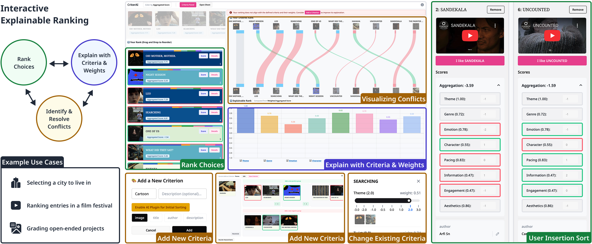

# Interactive Explainable Ranking

[**Link to CHI 2026 Paper**](https://doi.org/10.1145/3772318.3790810)

We propose an interactive decision-making tool for discovering and exploring explainable rankings for a given set of choices (e.g., job offers, vacation destinations, award candidates). We define an explainable ranking as an ordering of choices based on some consistent weighting of measured criteria. Our tool is designed to help users explore different orderings, criteria, and criterion weights in search of an explainable ranking that reflects their own personal preferences. To achieve this, we combine visualization, optimization, and (optionally) the integration of AI to help users identify and correct or explain inconsistencies in their evaluation of different choices. Through user experiments, we demonstrate that our tool leads to more consistent explainable rankings with greater user confidence.



## Setup
First, run the development server:

```bash
npm run dev
# or
yarn dev
# or
pnpm dev
```

Open [http://localhost:3000](http://localhost:3000) with your browser to see the result.

## CHI 2026 Paper

**Interactive Explainable Ranking**</br>
Chao Zhang and Abe Davis


**Please cite this paper if you used the code or prompts in this repository.**

> Chao Zhang and Abe Davis. 2026. Interactive Explainable Ranking. In Proceedings of the 2026 CHI Conference on Human Factors in Computing Systems (CHI '26). Association for Computing Machinery, New York, NY, USA, Article 619, 1–17. https://doi.org/10.1145/3772318.3790810

```bibtex
@inproceedings{10.1145/3772318.3790810,
author = {Zhang, Chao and Davis, Abe},
title = {Interactive Explainable Ranking},
year = {2026},
isbn = {9798400722783},
publisher = {Association for Computing Machinery},
address = {New York, NY, USA},
url = {https://doi.org/10.1145/3772318.3790810},
doi = {10.1145/3772318.3790810},
abstract = {We propose an interactive decision-making tool for discovering and exploring explainable rankings for a given set of choices (e.g., job offers, vacation destinations, award candidates). We define an explainable ranking as an ordering of choices based on some consistent weighting of measured criteria. Our tool is designed to help users explore different orderings, criteria, and criterion weights in search of an explainable ranking that reflects their own personal preferences. To achieve this, we combine visualization, optimization, and (optionally) the integration of AI to help users identify and correct or explain inconsistencies in their evaluation of different choices. Through user experiments, we demonstrate that our tool leads to more consistent explainable rankings with greater user confidence.},
booktitle = {Proceedings of the 2026 CHI Conference on Human Factors in Computing Systems},
articleno = {619},
numpages = {17},
keywords = {Ranking, Decision-Making},
location = {Barcelona, Spain},
series = {CHI '26}
}
```

## How to Use

1. **Load your data** — Paste a Google Sheet link or upload a CSV/TSV file. Then select which columns to use as criteria, info, and images.
2. **Set your target ranking** — In the Target Rank panel, drag and drop items into your preferred order. You can also use Insertion Sort for guided pairwise comparisons.
3. **Adjust criterion weights** — In the Weights panel, drag the weight bars to change how much each criterion matters. Click Estimate Weights to automatically find weights that best explain your ranking.
4. **Identify conflicts** — The Rank Comparison slope chart highlights conflicts between your target ranking and the weight-based ranking. Green lines mean agreement; red lines mean contradiction.
5. **Resolve conflicts** — Click on conflicting items to compare them side by side. You can edit scores directly, adjust weights, or add new criteria to resolve the inconsistency.
6. **Add new criteria** — Click Add a Criterion to define a new criterion. Optionally use AI to generate initial scores based on a text description.
7. **Export** — When satisfied, click Export Data to download your final ranking and data as a TSV file.

## Data Format

Your data file (CSV or TSV) must follow the format below. See an [example sheet](https://docs.google.com/spreadsheets/d/1WOgYKSJMVTJcHmguyRtQBwJ9iWesat55N6mFIp5uXfs/edit?usp=sharing) for reference.

| UID Column | Column A | Column B | Column C |
| --- | --- | --- | --- |
| **index:UID** | Column A | Column B | Column C |
| cprop:type:info | name | criterion | image |
| cprop:weight:1 | | 1 | |
| ABC | Item 1 | 5 | https://... |
| DEF | Item 2 | 3 | https://... |

- **`index:UID`** — First column header must have the `index:` prefix to mark the unique identifier column. **Required.**
- **`cprop:type:default`** — Second row defines column types. The value after the last colon is the default type for unlabeled columns. Valid types: `name`, `criterion`, `image`, `video`, `link`, `file`, `info`, `filter`.
- **`cprop:weight:default`** — Third row defines default weights for criterion columns.

## Contact

- [Chao Zhang](https://chaozhang.design/) — [cz468@cornell.edu](mailto:cz468@cornell.edu)
- Abe Davis — [abedavis@cornell.edu](mailto:abedavis@cornell.edu)
